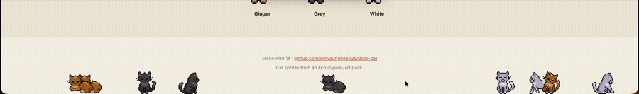
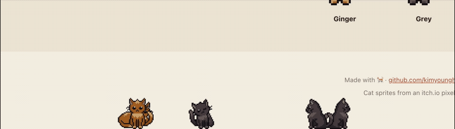

# 🐱 DockCat

Cute pixel cats that live at the bottom of your macOS screen. They wander, groom,
nap, and get startled when you toss them around. Pure eye candy for your desktop.

**Website:** https://kimyounghee425.github.io/dock-cat/



## Features

- 🐾 **Roam the dock** — cats stroll along the bottom of the screen and mostly sit,
  groom, tail-wag, and chill.
- 😴 **Naps & hisses** — idle long enough and they curl up to sleep; poke a sleeping
  cat and it hisses (facing matches how it lay down).
- ✋ **Drag & drop** — pick a cat up and place it anywhere on the floor. Drop it on
  the center trash to give it away.
- 🐱 **Many cats** — three colors (Ginger / Grey / White), up to three each.
- 🌙 **Batch controls** — "Sleep all", "Wake all", and a "Don't wake" mode.
- 🌐 **Bilingual & light** — English / 한국어, lives quietly in the menu bar.



## Install

1. Download the latest `DockCat-x.y.z-arm64.dmg` from
   [Releases](https://github.com/kimyounghee425/dock-cat/releases) (Apple Silicon).
2. Open the `.dmg` and drag **DockCat** into Applications.
3. First launch: **right-click → Open** (the app isn't notarized yet, so Gatekeeper
   shows a warning the first time).

Open settings from the cat icon in the menu bar.

## Build from source

Requires Node and [pnpm](https://pnpm.io).

```bash
pnpm install
pnpm dev          # run in development
pnpm dist:mac     # build an unsigned .dmg + .app into dist/
```

## Tech

Electron · electron-vite · React · TypeScript. The pet renders on a transparent,
always-on-top, click-through overlay window; only the cat's pixels capture the
mouse. Behaviour is an asset-agnostic state machine, so swapping sprites never
touches the logic.

## Credits

Cat sprites are from an itch.io pixel-art pack. Check the pack's license before
redistributing commercially.
